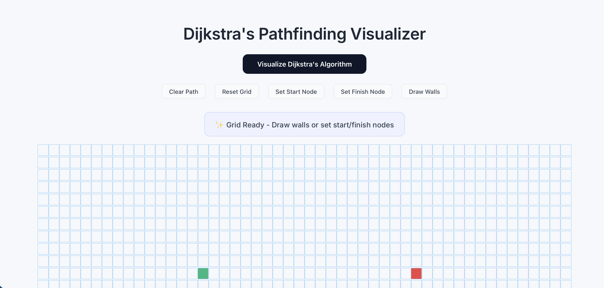
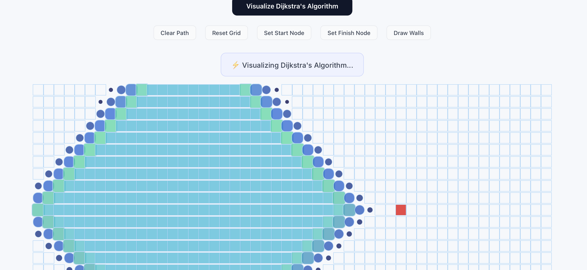
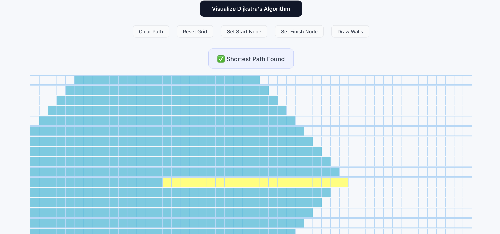

[![Contributors][contributors-shield]][contributors-url]
[![Forks][forks-shield]][forks-url]
[![Stargazers][stars-shield]][stars-url]
[![Issues][issues-shield]][issues-url]

# Dijkstra Pathfinding Visualizer

## Overview

The **Dijkstra Pathfinding Visualizer** is an interactive web application that demonstrates how **Dijkstra's Algorithm** finds the shortest path between two nodes in a grid.

Users can interact with the grid by creating walls, moving the start and finish nodes, and watching how the algorithm explores the grid step-by-step before determining the optimal path.

This project helps in understanding **graph traversal, shortest path algorithms, and algorithm visualization** in a clear and interactive way.

---

## Built With

[![React][React.js]][React-url]  
[![JavaScript][Js.js]][Js-url]  
[![CSS][CSS.js]][CSS-url]  
[![HTML][HTML.js]][HTML-url]

---

## Table of Contents

- [Features](#features)
- [Installation](#installation)
- [How It Works](#how-it-works)
- [Screenshots](#screenshots)
- [Future Improvements](#future-improvements)
- [Contributing](#contributing)

---

## Features

### Interactive Grid
Users can click and drag on the grid to create walls and obstacles.

### Start & Finish Node Placement
Move the **start node** and **finish node** anywhere on the grid.

### Dijkstra Algorithm Visualization
Watch how Dijkstra's algorithm:

- Explores neighboring nodes
- Expands from the start node
- Finds the shortest path to the destination

### Path Animation
The shortest path is animated once the algorithm finishes execution.

### Controls

| Control | Function |
|-------|--------|
| Visualize Algorithm | Runs Dijkstra's Algorithm |
| Clear Path | Clears visited nodes but keeps walls |
| Reset Grid | Resets the grid to default state |
| Set Start Node | Choose the starting position |
| Set Finish Node | Choose the destination node |
| Draw Walls | Create obstacles in the grid |

### Status Messages

The interface shows helpful hints such as:

✨ Grid Ready  
🧱 Drawing walls  
⚡ Visualizing algorithm  
✅ Shortest path found  
❌ No path found  

---

## Installation

### 1 Clone the repository

```bash
git clone https://github.com/Kashish1912/Mind-Runner.git
```

### 2 Navigate into the project

```bash
cd Mind-Runner
```

### 3 Install dependencies

```bash
npm install
```

### 4 Start the application

```bash
npm start
```

The app will run at:

```
http://localhost:3000
```

---

## How It Works

### Dijkstra's Algorithm

Dijkstra's algorithm is used to find the shortest path between nodes in a graph.

Steps used in the visualization:

1. Start from the **start node**
2. Visit all neighboring nodes
3. Update distances to each node
4. Continue selecting the closest unvisited node
5. Stop when the **finish node** is reached
6. Trace back the **shortest path**

The visualization animates both:

- The order in which nodes are visited
- The final shortest path

---

## Screenshots

   

---

## Future Improvements

Possible features to add in the future:

- Support for more algorithms
  - A* Search
  - Breadth First Search
  - Depth First Search
- Maze generation
- Adjustable visualization speed
- Weighted nodes
- Mobile responsive UI
- Algorithm comparison mode

---

## Contributing

Contributions are welcome!

If you would like to improve the project:

1. Fork the repository
2. Create a new branch
3. Submit a pull request

Bug reports and feature suggestions are always appreciated.

If you find this project useful, consider giving it a ⭐ on GitHub.

---

<!-- MARKDOWN LINKS -->

[contributors-shield]: https://img.shields.io/github/contributors/Kashish1912/Maze-Runner.svg?style=for-the-badge
[contributors-url]: https://github.com/Kashish1912/Maze-Runner/graphs/contributors
[forks-shield]: https://img.shields.io/github/forks/Kashish1912/Maze-Runner.svg?style=for-the-badge
[forks-url]: https://github.com/Kashish1912/Maze-Runner/network/members
[stars-shield]: https://img.shields.io/github/stars/Kashish1912/Maze-Runner.svg?style=for-the-badge
[stars-url]: https://github.com/Kashish1912/Maze-Runner/stargazers
[issues-shield]: https://img.shields.io/github/issues/Kashish1912/Maze-Runner.svg?style=for-the-badge
[issues-url]: https://github.com/Kashish1912/Maze-Runner/issues

[React.js]: https://img.shields.io/badge/React-20232A?style=for-the-badge&logo=react&logoColor=61DAFB
[React-url]: https://reactjs.org/
[Js.js]: https://img.shields.io/badge/JavaScript-F7DF1E?style=for-the-badge&logo=javascript&logoColor=black
[Js-url]: https://www.javascript.com/
[CSS.js]: https://img.shields.io/badge/CSS3-1572B6?style=for-the-badge&logo=css3
[CSS-url]: https://developer.mozilla.org/en-US/docs/Web/CSS
[HTML.js]: https://img.shields.io/badge/HTML5-E34F26?style=for-the-badge&logo=html5
[HTML-url]: https://developer.mozilla.org/en-US/docs/Web/HTML
